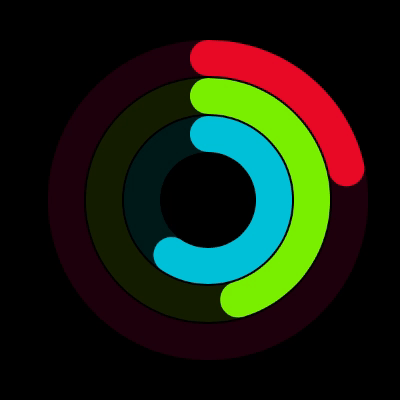
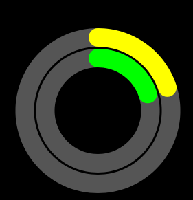
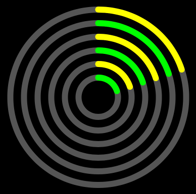
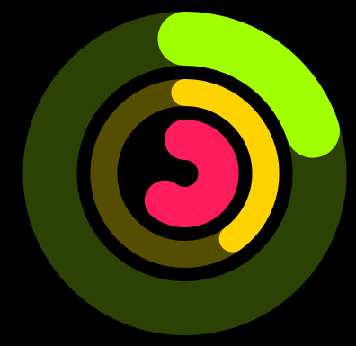

# ConcentricProgressRingView

[](https://travis-ci.org/Dan Loewenherz/ConcentricProgressRingView)
[](http://cocoapods.org/pods/ConcentricProgressRingView)
[](http://cocoapods.org/pods/ConcentricProgressRingView)
[](http://cocoapods.org/pods/ConcentricProgressRingView)



## Example

To run the example project, clone the repo, and run `pod install` from the Example directory first.

### Usage

At the top of your file, make sure to import "ConcentricProgressRingView"

```swift
import ConcentricProgressRingView
```

Then, instantiate ConcentricProgressRingView in your view controller:

```swift
func viewDidLoad() {
    super.viewDidLoad()

    let foregroundColor1 = UIColor.yellowColor()
    let backgroundColor1 = UIColor.darkGrayColor()
    let foregroundColor2 = UIColor.greenColor()
    let backgroundColor2 = UIColor.darkGrayColor()

    let rings = [
        ProgressRing(color: foregroundColor1, backgroundColor: backgroundColor1, width: 18, progress: 0.2),
        ProgressRing(color: foregroundColor2, backgroundColor: backgroundColor2, width: 18, progress: 0.2),
    ]

    let margin: CGFloat = 2
    let radius: CGFloat = 80
    let ring = ConcentricProgressRingView(center: view.center, radius: radius, margin: margin, rings: rings)

    view.addSubview(ring)
}
```



You can customize the width, margin, and radius parameters to customize everything to your liking. You can add as many bars as you want. Here's another example with 6 progress bars, with a smaller bar width, larger margin between bars, and a larger radius:

```swift
let bars = [
    ProgressRing(color: foregroundColor1, backgroundColor: backgroundColor1, width: 10, percent: 0.2),
    ProgressRing(color: foregroundColor2, backgroundColor: backgroundColor2, width: 10, percent: 0.2),
    ProgressRing(color: foregroundColor1, backgroundColor: backgroundColor1, width: 10, percent: 0.2),
    ProgressRing(color: foregroundColor2, backgroundColor: backgroundColor2, width: 10, percent: 0.2),
    ProgressRing(color: foregroundColor1, backgroundColor: backgroundColor1, width: 10, percent: 0.2),
    ProgressRing(color: foregroundColor2, backgroundColor: backgroundColor2, width: 10, percent: 0.2),
]

let margin: CGFloat = 10
let radius: CGFloat = 120
let ring = ConcentricProgressRingView(center: view.center, radius: radius, margin: margin, bars: bars)
```



Repeating widths, progress percentages, colors, and background colors can get a bit tedious, so you can omit them and provide default values in the initializer. If you don't, the compiler will warn you that there's a problem. The initializer with defaults can throw an error if you provide invalid parameters, so you'll also need to handle errors.

```swift
let rings = [
    ProgressRing(color: foregroundColor1, backgroundColor: backgroundColor1),
    ProgressRing(color: foregroundColor2, backgroundColor: backgroundColor2),
    ProgressRing(color: foregroundColor1, backgroundColor: backgroundColor1),
    ProgressRing(color: foregroundColor2, backgroundColor: backgroundColor2),
    ProgressRing(color: foregroundColor1, backgroundColor: backgroundColor1),
    ProgressRing(color: foregroundColor2, backgroundColor: backgroundColor2),
]

let margin: CGFloat = 10
let radius: CGFloat = 120
let width: CGFloat = 8
let progress: CGFloat = 0.2
let ring = try? ConcentricProgressRingView(center: view.center, radius: radius, margin: margin, rings: rings, defaultColor: nil, defaultWidth: width, defaultProgress: progress)
```

Rings can have varying widths, colors, and background colors.

```swift
let rings = [
    ProgressRing(width: 40, percent: 0.2, color: UIColor(.RGB(160, 255, 0)), backgroundColor: UIColor(.RGB(44, 66, 4))),
    ProgressRing(width: 20, percent: 0.4, color: UIColor(.RGB(255, 211, 0)), backgroundColor: UIColor(.RGB(85, 78, 0))),

    // Background color is optional, so go ahead and skip it.
    ProgressRing(width: 30, percent: 0.6, color: UIColor(.RGB(255, 28, 93)))
]
ring = ConcentricProgressRingView(center: view.center, radius: radius, margin: margin, bars: bars)
```



#### Animation

To animate a progress update, use the `set` method.

```swift
ring.arcs[1].setProgress(0.5, duration: 2)
```

You can also use subscripts to access the individual arcs:

```swift
ring[1].setProgress(0.5, duration: 2)
```

If you just want to change the progress, just set the progress on the ring, and it'll change it immediately.

```swift
ring[1].progress = 0.5
```

## Requirements

## Installation

ConcentricProgressRingView is available through [CocoaPods](http://cocoapods.org). To install
it, simply add the following line to your Podfile:

```ruby
pod "ConcentricProgressRingView"
```

## TODO

* [ ] Swift 3
* [ ] Documentation
* [ ] Tests

## Author

Dan Loewenherz, dan@lionheartsw.com

## License

ConcentricProgressRingView is available under the Apache 2.0 license. See the LICENSE file for more info.
